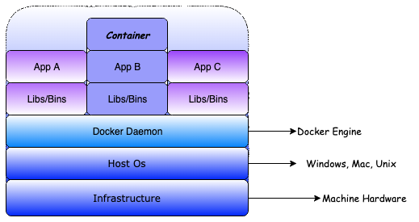

Why Docker

1. Industry acceptance
2. Isolation from the main system - you can pick minimal system required, e.g. Python 3.8 on Linux
3. Configuration - provide ways of different configuration of images.
4. Docker Hub (https://hub.docker.com), company's own Docker Registry or Docker Registries by Cloud providers.
5. CI (Continuous Integration) - works with CI tools like Jenkins, Github Actions, Gitlab, etc..

Docker can easily solve problems of:

1. Dependency matrix
2. Migration nightmare
3. Works on my machine but not on yours!

What it Docker?

`Docker is a set of platform as a service (PaaS) products that use OS-level virtualization to deliver software in packages called containers. Containers are isolated from one another and bundle their own software, libraries and configuration files; they can communicate with each other through well-defined channels. All containers are run by a single operating system kernel and therefore use fewer resources than virtual machines. [Wikiepdia]`

How Docker is different from Virtual Machine?

Docker is software used for Virtualization to enable multiple Operating systems to run on the same host. This is the Hypervisors used to create a virtual machine, namely ESXi. On the contrary, this process takes place at the system-level in Docker. As you can see the difference in the image below, the Docker container runs on the hypervisor and above the Operating system. This helps you increase efficiency. In addition, we can run more containers on the same infrastructure than we can run multiple virtual machines because containers consume less resources.

Source https://www.tayfundeger.com/what-is-docker.html

Image
Imagine you're doing OOP programing. An image is like "Class" you create while a container is like an instance of "Image". You can create Linux image with Python 3.8 with removing all other redandancies. Later you can use the image with installing your required apps and libs to create a container.

Container
A container is an instance of an image. Like mentioned, an image is like template which can be used to create a container. So, if you fetch a Python 3.8 image from Docker and run an instance of it, you can create your own container using the image with adding or configuring whatever you need. If you need to tweak the container, you can still use the same image but recreating a container from the existing image.

Useful links:

25 Basic Docker Commands for Beginners

https://codeopolis.com/posts/25-basic-docker-commands-for-beginners/?utm_source=wikipedia.org&utm_medium=referral&utm_campaign=always-on+-+wikipedia+external+links&utm_content=textlink+-+wikipedia+docker+article

https://www.docker.com
